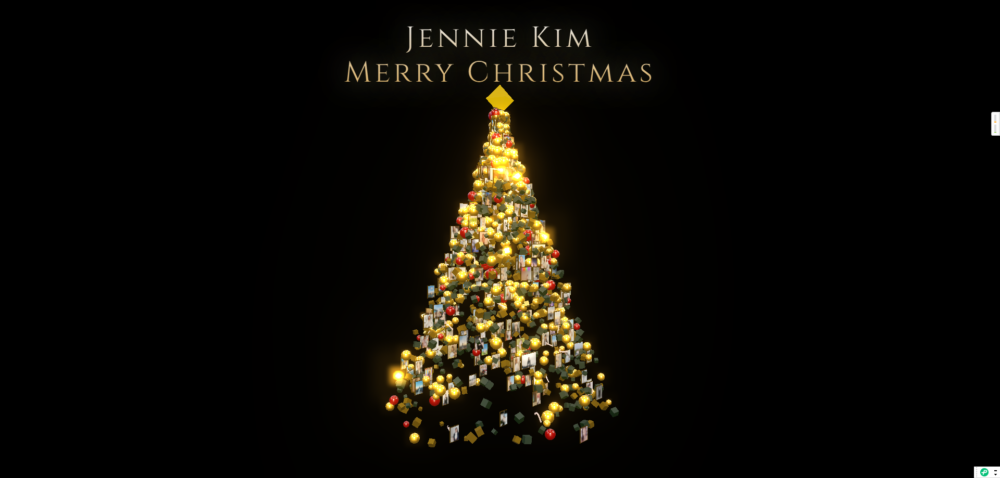

# JennieKim - 圣诞节3D照片画廊

一个基于Three.js的沉浸式3D圣诞树照片画廊，展示Jennie Kim的照片集。

## 🙏 致谢

本项目全流程由 **iFlow CLI** 和 **GLM-4.7** 对话式完成开发。感谢 iFlow 团队和 GLM 大模型团队开发的伟大作品以及所有工作人员的辛勤付出！🎉🎉🎉

- **iFlow CLI**: [https://platform.iflow.cn/](https://platform.iflow.cn/) - 超智能的极致心流体验
- **GLM-4.7**: [https://bigmodel.cn/](https://bigmodel.cn/) - Video Coding能力全球开源第一

## 🖼️ 效果预览



## 🎄 项目特色

- **3D圣诞树展示**: 照片以装饰品形式挂在3D圣诞树上
- **手势控制**: 支持MediaPipe手势识别进行交互
- **动态粒子效果**: 金色、绿色、红色装饰球和糖果手杖
- **照片上传**: 支持用户上传自己的照片
- **响应式设计**: 适配各种屏幕尺寸
- **高质量渲染**: 使用UnrealBloom后处理效果

## 📁 项目结构

```
Merry Christmas/
├── index.html              # 主页面
├── README.md               # 项目说明文档 (英文)
├── README_CN.md            # 项目说明文档 (中文)
├── LICENSE                 # MIT许可证文件
├── assets/                 # 资源文件夹
│   ├── images/
│   │   └── preview.png     # 应用界面截图
│   ├── js/
│   │   └── photoGallery.js # 照片库管理 + 浏览管理器
│   ├── models/             # MediaPipe模型文件
│   │   └── hand_landmarker.task
│   └── wasm/               # WebAssembly文件
│       ├── vision_wasm_internal.js
│       └── vision_wasm_internal.wasm
└── JennieKim_430px/        # 处理后的照片文件夹(260+张照片, 高度430px)
```

## 🚀 快速开始

### 本地运行

1. 克隆仓库
```bash
git clone https://github.com/stone100010/JennieKim.git
cd JennieKim
```

2. 启动本地服务器
```bash
# 使用Python
python -m http.server 8000

# 或使用Node.js
npx serve .

# 或使用PHP
php -S localhost:8000
```

3. 在浏览器中访问 `http://localhost:8000`

### 照片处理

如果需要处理新的照片：

```bash
# 确保已安装Pillow
pip install Pillow

# 运行图片处理脚本
python resize_images.py
```

该脚本会将`JennieKim`文件夹中的所有图片调整为高度430px，保持宽高比，并保存到`JennieKim_430px`文件夹。

## 🎮 交互控制

### 手势控制（需要摄像头权限）
- **握拳**: 切换到树形模式
- **张开手掌**: 切换到散开模式  
- **捏合手势**: 聚焦随机照片（智能随机浏览，避免重复）

### 调试键盘快捷键
- **R键**: 重置照片浏览顺序
- **M键**: 切换随机/顺序浏览模式
- **P键**: 显示浏览进度（控制台查看）

### 鼠标控制
- **拖拽**: 旋转3D场景
- **滚轮**: 缩放视图

## 🎯 当前版本特性

### 客户定制优化
- ✅ 移除上传功能，专注照片展示
- ✅ 简化UI界面，无多余控件
- ✅ 默认随机浏览模式，体验更佳
- ✅ 完全本地化运行，无CDN依赖
- ✅ 260+张Jennie照片，智能浏览管理

### 浏览体验
- 🎲 **随机浏览**: 默认模式，每次捏合显示不同照片
- 🔄 **避免重复**: 已查看照片不会重复出现
- 🔁 **自动重置**: 浏览完所有照片后自动重新开始
- 📊 **进度追踪**: 实时显示浏览进度和状态

## 🛠️ 技术栈

- **Three.js**: 3D图形渲染
- **MediaPipe**: 手势识别
- **WebGL**: 硬件加速渲染
- **Post-processing**: 后处理效果
- **HTML5**: 现代Web标准

## 📸 照片管理

项目包含260张Jennie Kim的照片，已优化为430px高度：

- 原始格式：WebP
- 优化尺寸：高度430px，保持宽高比
- 总数量：260张
- 存储位置：`JennieKim_430px/`

照片通过`photoGallery.js`模块管理，支持：
- 随机获取照片
- 打乱照片顺序
- 获取指定索引照片
- 获取照片总数

## 🎨 视觉效果

- **粒子系统**: 1500个装饰粒子 + 2500个尘埃粒子
- **光照系统**: 多光源设置，包括环境光、点光源和聚光灯
- **材质效果**: 金属质感、发光效果、透明度处理
- **后处理**: 辉光效果、色调映射

## 🔧 配置选项

主要配置参数在`index.html`中的CONFIG对象：

```javascript
const CONFIG = {
    colors: {
        bg: 0x000000,           // 背景色
        champagneGold: 0xffd966, // 香槟金
        deepGreen: 0x03180a,     // 深绿色
        accentRed: 0x990000,     // 强调红
    },
    particles: {
        count: 1500,     // 装饰粒子数量
        dustCount: 2500, // 尘埃粒子数量
        treeHeight: 24,  // 树高度
        treeRadius: 8    // 树半径
    }
};
```

## 🌟 特色功能

1. **智能照片布局**: 照片自动适配3D空间，保持正确宽高比
2. **流畅动画**: 所有过渡效果都经过优化，确保60fps流畅体验
3. **手势识别**: 实时手势检测，支持多种交互模式
4. **动态加载**: 照片异步加载，不阻塞页面渲染
5. **响应式设计**: 自动适配不同设备和屏幕尺寸

## 📱 浏览器兼容性

- Chrome 90+
- Firefox 88+
- Safari 14+
- Edge 90+

需要支持：
- WebGL 2.0
- ES6 Modules
- MediaPipe WebAssembly
- getUserMedia API

## 🤝 贡献指南

1. Fork 项目
2. 创建功能分支 (`git checkout -b feature/AmazingFeature`)
3. 提交更改 (`git commit -m 'Add some AmazingFeature'`)
4. 推送到分支 (`git push origin feature/AmazingFeature`)
5. 打开 Pull Request

## 📄 许可证

本项目采用 MIT 许可证 - 查看 [LICENSE](LICENSE) 文件了解详情

## 🎁 致谢

- Three.js 团队提供的优秀3D库
- Google MediaPipe 手势识别技术
- 所有照片素材的创作者

---

**Merry Christmas & Happy New Year! 🎄✨**